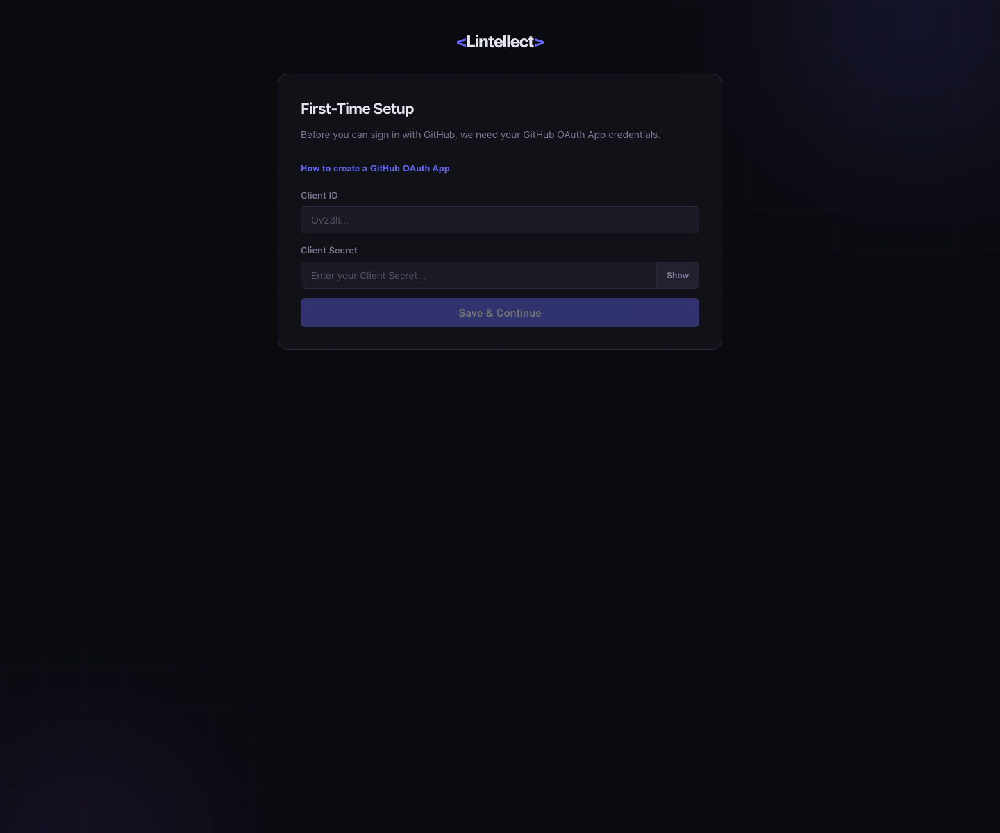
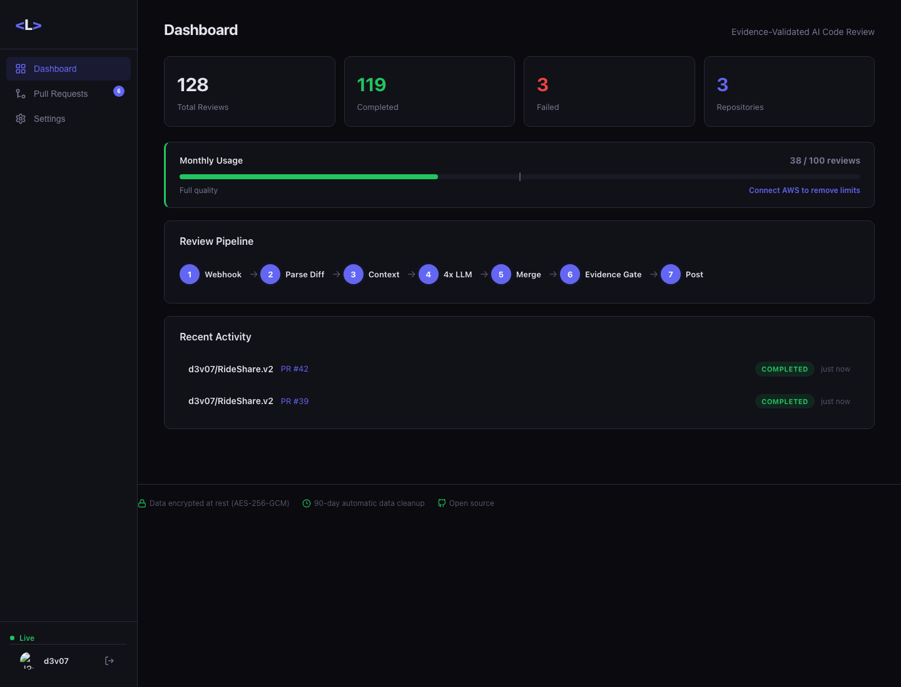
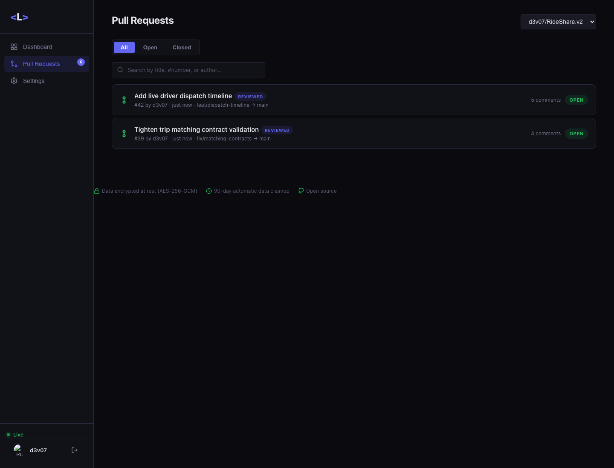
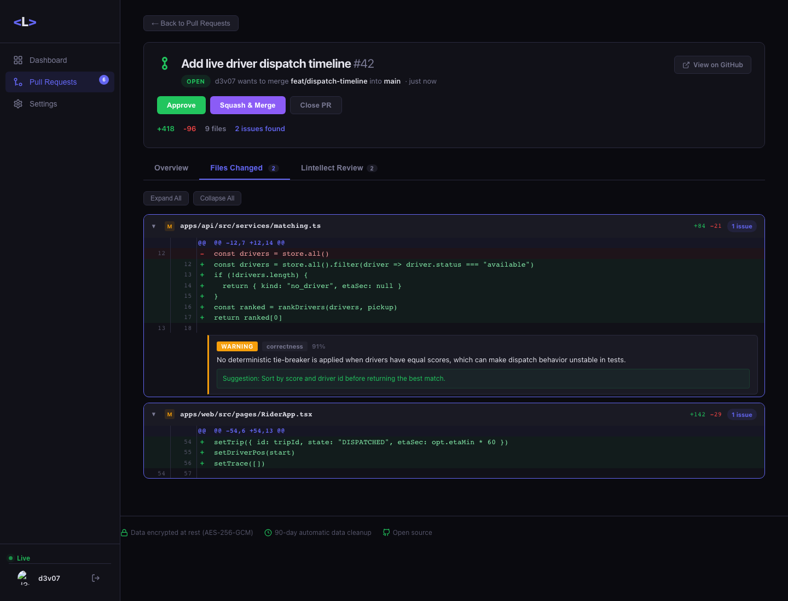
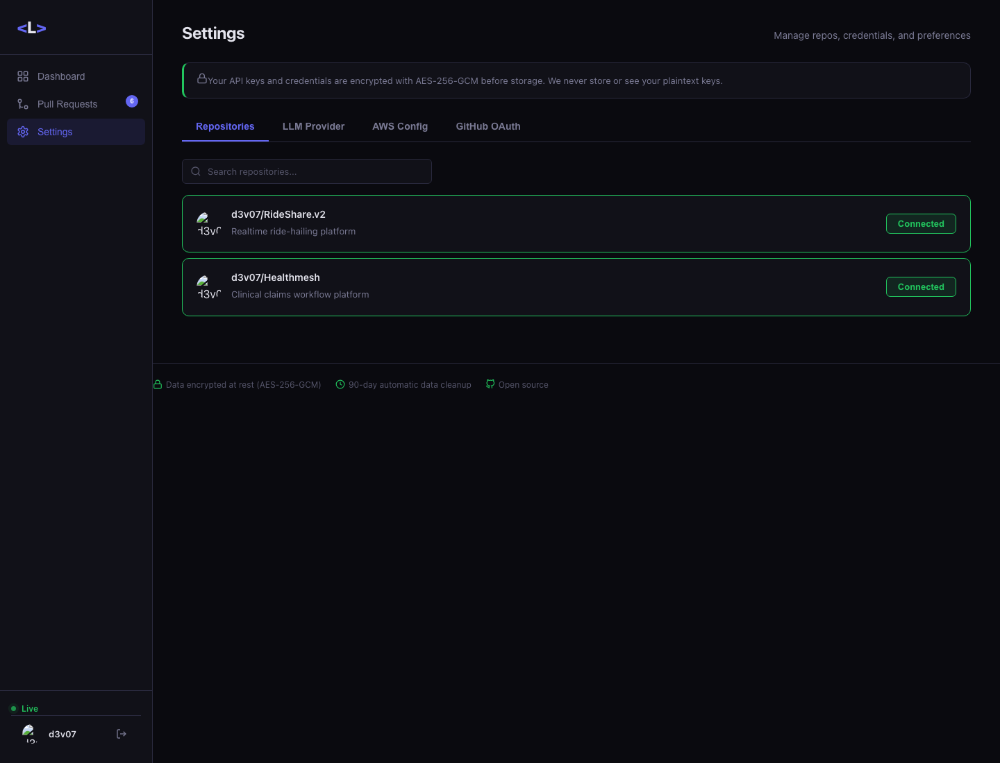
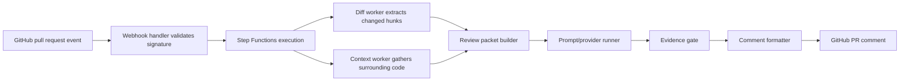
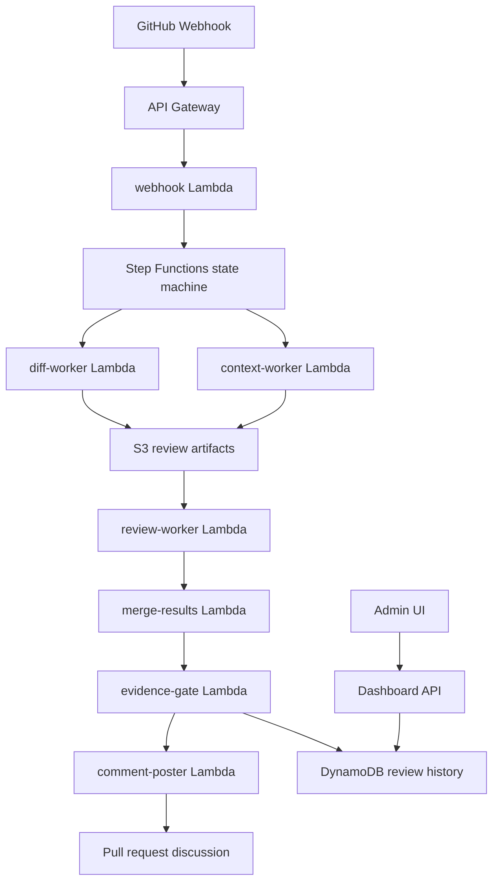

# Lintellect

Serverless pull request review pipeline that turns a GitHub webhook into parallel review packets, evidence-gated findings, and an operator dashboard.

Lintellect is a TypeScript monorepo for experimenting with review automation architecture: webhook ingestion, diff/context workers, provider adapters, schema validation, prompt runners, an evidence gate, and admin/dashboard surfaces. The repo is structured so the review pipeline can be tested locally while the deployment target remains AWS Lambda, Step Functions, S3, DynamoDB, and API Gateway.

## Contents

- [At A Glance](#at-a-glance)
- [Screenshot Gallery](#screenshot-gallery)
- [Review Lifecycle](#review-lifecycle)
- [Architecture](#architecture)
- [Package Map](#package-map)
- [Schemas](#schemas)
- [Tech Stack](#tech-stack)
- [Run Locally](#run-locally)
- [Verification](#verification)
- [Deployment Notes](#deployment-notes)
- [Status](#status)
- [License](#license)

## At A Glance

| Area | Details |
|---|---|
| Product | Event-driven PR review pipeline |
| Users | Engineering teams that want structured review findings with evidence |
| Core value | Split review work into traceable packets and filter output through a quality gate before comments are posted |
| Runtime target | AWS Lambda + Step Functions |
| Local code | TypeScript workspaces with Vitest coverage |
| UI surface | Admin/dashboard packages for configuration and review visibility |

## Screenshot Gallery

| Image | Caption |
|---|---|
|  | Initial setup state for configuring provider and review pipeline settings before packet execution. |
|  | Authenticated dashboard with review counts, monthly usage, pipeline stages, and recent review activity. |
|  | Pull request queue with connected repository selector, review filters, and reviewed PR indicators. |
|  | PR detail view with changed files, evidence-gated findings, severity labels, and review actions. |
|  | Repository settings screen for connecting repositories and managing review coverage. |

## Review Lifecycle



## Architecture



## Package Map

| Path | Responsibility |
|---|---|
| `packages/core` | Review packet building, schema validation, prompt runner, evidence gate tests |
| `packages/providers` | Provider abstraction and provider tests |
| `packages/api` | Dashboard API entrypoint |
| `packages/cli` | Local command surface |
| `packages/admin` | Admin UI |
| `packages/dashboard` | Dashboard UI |
| `schemas` | JSON schemas for packets, comments, job status, and provider config |
| `docs` | Pipeline, architecture, prompting, and testing notes |

## Schemas

The pipeline is schema-first. Review packets, review output, comments, job status, and provider config are stored in `schemas/` so worker boundaries can validate structured data before a result reaches the evidence gate.

## Tech Stack

| Layer | Technology |
|---|---|
| Language | TypeScript |
| Infrastructure | AWS CDK target, Lambda, Step Functions, API Gateway |
| Storage | S3 artifacts, DynamoDB history |
| Frontend | React/Vite packages |
| Testing | Vitest |
| Contracts | JSON Schema |

## Run Locally

```bash
npm install
npm test
```

Build all workspaces:

```bash
npm run build
```

Run the dashboard/admin package from its package directory when working on UI surfaces.

## Verification

Local build results:

| Command | Result |
|---|---|
| `npm run build` in `packages/admin` | Passed in the previous docs/screenshot pass |
| `npm run build` in `packages/dashboard` | Passed in the current README/build verification slice |

The checked dashboard build now passes. Core tests and package-specific tests should be run before publishing.

## Deployment Notes

Production deployment expects:

```bash
GITHUB_WEBHOOK_SECRET=
GITHUB_TOKEN=
AWS_REGION=us-east-1
DYNAMO_TABLE_NAME=
S3_BUCKET_NAME=
```

Keep webhook secrets and provider credentials in environment variables or a secret manager.

## Status

The architecture and core contracts are useful and portfolio-worthy. The checked dashboard build now passes; before publishing, run core/package tests and verify deployment configuration with real provider credentials kept outside git.

## License

MIT. See [LICENSE](LICENSE).
