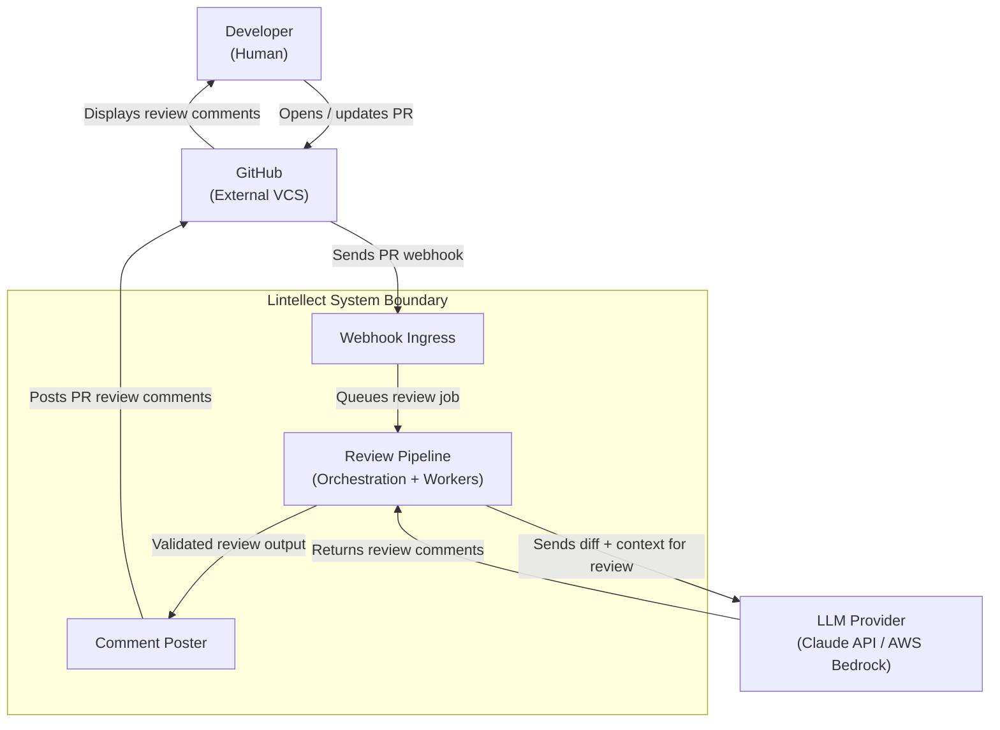
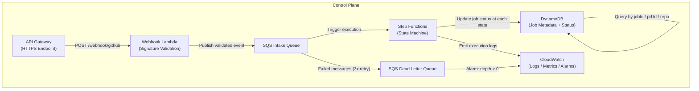
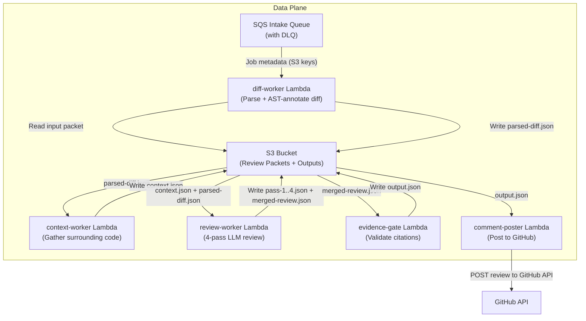
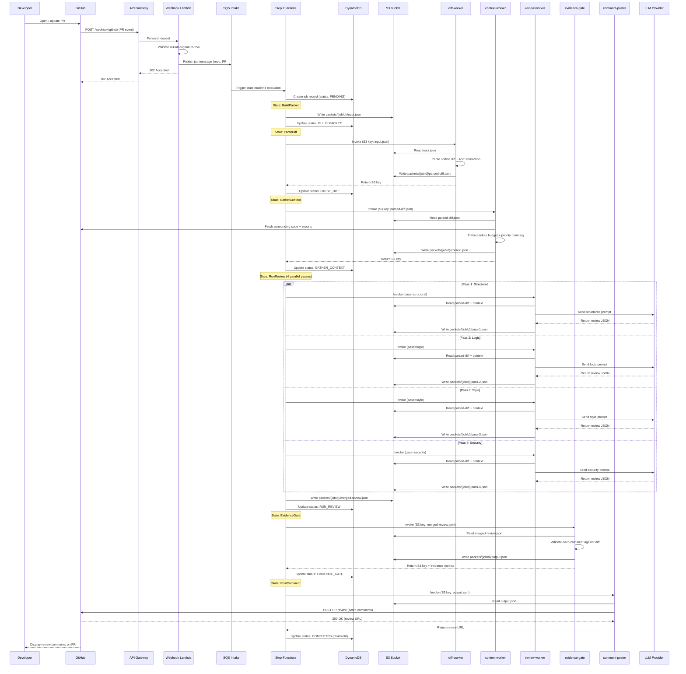
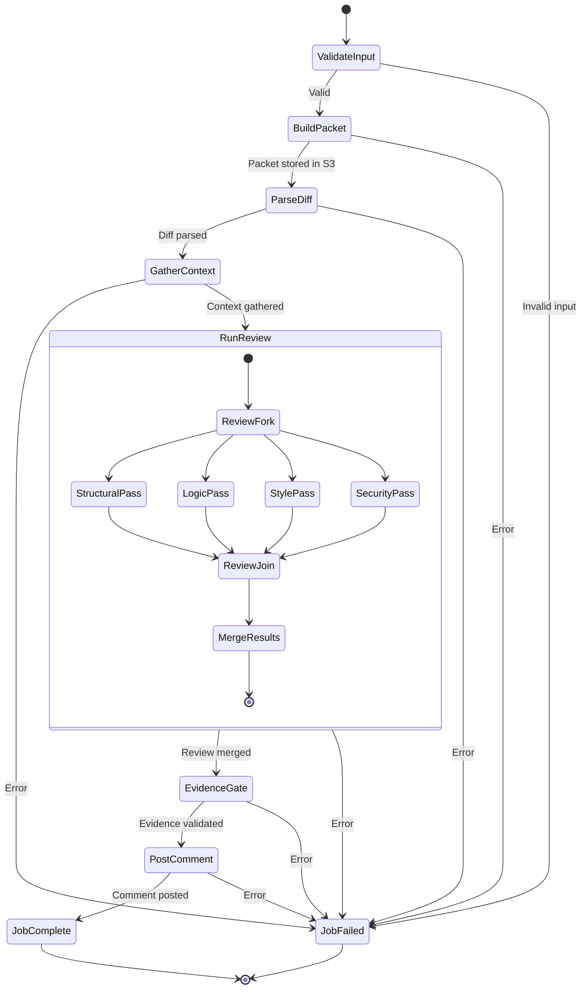
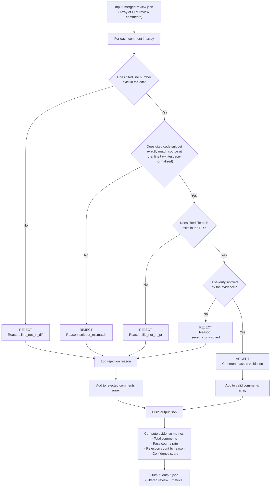
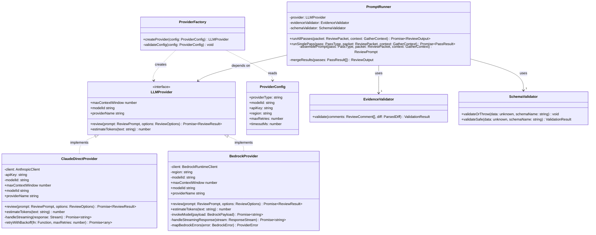

# Lintellect -- Architecture Document

**Project:** Lintellect -- AI-Powered Code Review System
**Task ID:** T-0.4
**Author:** Plan agent
**Created:** 2026-02-07
**Status:** DRAFT

---

## Table of Contents

1. [System Context Diagram (C4 Level 1)](#1-system-context-diagram-c4-level-1)
2. [Control Plane Diagram](#2-control-plane-diagram)
3. [Data Plane Diagram](#3-data-plane-diagram)
4. [End-to-End Flow Diagram](#4-end-to-end-flow-diagram)
5. [Step Functions State Machine](#5-step-functions-state-machine)
6. [Evidence Gate Validation Flow](#6-evidence-gate-validation-flow)
7. [LLM Provider Adapter Pattern](#7-llm-provider-adapter-pattern)
8. [Component Inventory and Responsibility Matrix](#8-component-inventory-and-responsibility-matrix)
9. [Data Flow: Review Packet Lifecycle](#9-data-flow-review-packet-lifecycle)
10. [Target Repository File Tree](#10-target-repository-file-tree)

---

## 1. System Context Diagram (C4 Level 1)

This diagram shows the Lintellect system boundary, external actors, and the primary data flows between them. Lintellect sits between GitHub (as the source of PR events and the destination for review comments) and an LLM Provider (Claude API or AWS Bedrock) that powers the AI review logic.



**Key relationships:**

- **Developer** interacts only with GitHub. They never interact with Lintellect directly.
- **GitHub** is both the event source (webhooks) and the feedback destination (PR review comments).
- **LLM Provider** is an external dependency accessed by the review pipeline. It is abstracted behind a provider adapter interface, making it pluggable between Claude Direct API and AWS Bedrock.
- **Lintellect** is the system under design. It receives webhooks, orchestrates the review, validates evidence, and posts results.

---

## 2. Control Plane Diagram

The control plane manages orchestration, job lifecycle, monitoring, and alerting. It does NOT touch review data (diffs, context, LLM outputs) directly. It operates exclusively on metadata: job IDs, status transitions, S3 keys, and error states.



**Design principles:**

- **Separation of concerns:** The control plane knows WHAT to do and WHEN, but not the review data itself.
- **Observability:** Every state transition is logged to CloudWatch and recorded in DynamoDB.
- **Failure isolation:** Failed messages land in the DLQ rather than blocking the intake queue. A CloudWatch alarm fires when the DLQ is non-empty.
- **Idempotency:** Each job has a unique `jobId`. Re-processing the same webhook produces the same job (deduplication via DynamoDB conditional writes).

---

## 3. Data Plane Diagram

The data plane handles all review data: diffs, context, LLM prompts, LLM outputs, and validated review comments. Data flows through S3 using a pass-by-reference pattern. Workers read from and write to S3; they never receive or return large payloads inline.



**Key properties:**

- **Pass-by-reference:** Workers exchange S3 keys, not data payloads. This avoids the Step Functions 256KB payload limit and keeps Lambda invocation payloads small.
- **Immutable artifacts:** Each stage writes a new file under `packets/{jobId}/`. No file is overwritten. This provides a full audit trail.
- **Independent scaling:** Each worker Lambda scales independently based on its own concurrency and memory requirements.
- **Retry safety:** Because artifacts are immutable and keyed by `jobId`, retrying any step is safe and idempotent.

---

## 4. End-to-End Flow Diagram

This sequence diagram traces a single PR review from webhook receipt to posted comment, showing every actor, every message, and every storage operation.



---

## 5. Step Functions State Machine

This state diagram shows the complete Step Functions state machine including retry configuration, catch blocks, and the parallel review passes.



**Retry and error handling configuration:**

| State | Timeout | Max Retries | Backoff | Catch Target |
|-------|---------|-------------|---------|--------------|
| ValidateInput | 30s | 0 | N/A | JobFailed |
| BuildPacket | 60s | 2 | Exponential (2s base) | JobFailed |
| ParseDiff | 120s | 2 | Exponential (2s base) | JobFailed |
| GatherContext | 120s | 2 | Exponential (5s base) | JobFailed |
| StructuralPass | 300s | 2 | Exponential (5s base) | JobFailed |
| LogicPass | 300s | 2 | Exponential (5s base) | JobFailed |
| StylePass | 300s | 2 | Exponential (5s base) | JobFailed |
| SecurityPass | 300s | 2 | Exponential (5s base) | JobFailed |
| MergeResults | 30s | 1 | Fixed (1s) | JobFailed |
| EvidenceGate | 60s | 1 | Fixed (1s) | JobFailed |
| PostComment | 60s | 3 | Exponential (2s base) | JobFailed |

**Pass-by-reference enforcement:** The state machine input and output at every step contains ONLY S3 keys and job metadata (jobId, status, timestamps). Raw diff data, context, and LLM outputs are NEVER passed through the state machine payload. This is critical for staying within the 256KB Step Functions payload limit.

**JobFailed state behavior:** On entry, the JobFailed state writes a failure record to DynamoDB containing the error type, error message, the state that failed, and the execution ARN. It then terminates the execution with a FAILED status.

---

## 6. Evidence Gate Validation Flow

The evidence gate is the critical quality filter that prevents hallucinated LLM review comments from reaching developers. Every comment produced by the LLM must cite specific, verifiable evidence from the actual diff. Comments that fail validation are stripped from the output.



**Validation rules in detail:**

1. **Line number exists in diff:** The cited line number must fall within a hunk range of the parsed diff for the cited file. Lines outside all hunk ranges are considered hallucinated.
2. **Code snippet exact match:** The cited code snippet, after whitespace normalization (collapse whitespace, trim), must match the actual source code at the cited line. This catches fabricated code.
3. **File path exists in PR:** The file path referenced by the comment must be one of the files modified in the PR. Comments referencing files not in the changeset are rejected.
4. **Severity justified:** The severity level (critical, warning, suggestion, nitpick) must be proportionate to the issue cited. A "critical" severity for a missing trailing newline, for example, would be rejected.

**Strictness modes:**

| Mode | Line Check | Snippet Check | File Check | Severity Check |
|------|-----------|--------------|-----------|---------------|
| `strict` | Exact line match | Exact character match | Exact path match | Enforced |
| `normal` | Exact line match | Whitespace-normalized match | Exact path match | Enforced |
| `lenient` | Within hunk range | Fuzzy substring match | Case-insensitive path | Warning only |

---

## 7. LLM Provider Adapter Pattern

The system supports multiple LLM providers through a pluggable adapter pattern. This allows switching between Claude Direct API and AWS Bedrock without changing any pipeline logic. The `PromptRunner` depends only on the `LLMProvider` interface, never on a concrete implementation.



**Provider selection at runtime:**

The `ProviderFactory.createProvider()` method reads `ProviderConfig` (from environment variables or CLI flags) and returns the appropriate concrete provider. The `PromptRunner` never knows which provider it is using. This enables:

- **CLI usage:** Developer sets `--provider claude-direct` and provides `ANTHROPIC_API_KEY`.
- **AWS Lambda usage:** Configuration specifies `bedrock` provider with `AWS_REGION`, and the Lambda role provides IAM credentials automatically.
- **Testing:** A mock provider can be injected for deterministic unit and integration tests.

---

## 8. Component Inventory and Responsibility Matrix

Every component in the Lintellect system, its type, responsibility, inputs, outputs, and dependencies.

| Component | Type | Responsibility | Inputs | Outputs | Dependencies |
|-----------|------|----------------|--------|---------|--------------|
| **webhook-lambda** | AWS Lambda | Validate GitHub webhook signature; extract PR metadata; publish to SQS | GitHub webhook HTTP request (headers + body) | SQS message with job metadata (repo, PR#, SHAs) | API Gateway, SQS intake queue, Secrets Manager (webhook secret) |
| **sqs-intake** | SQS Queue | Buffer incoming review jobs; decouple webhook from pipeline; provide at-least-once delivery | Messages from webhook-lambda | Triggers Step Functions execution | Step Functions, SQS DLQ |
| **sqs-dlq** | SQS Queue (DLQ) | Capture messages that fail processing after 3 attempts; enable manual investigation | Failed messages from sqs-intake (after maxReceiveCount) | CloudWatch alarm trigger | CloudWatch |
| **step-functions** | AWS Step Functions (Standard) | Orchestrate the full review pipeline; manage state transitions, retries, and error handling; update job status | SQS message (job metadata) | Execution completion event (success/failure) | All worker Lambdas, DynamoDB, S3, CloudWatch |
| **packet-builder** | Core library (TypeScript) | Construct a ReviewPacket from webhook payload and GitHub API data; validate against schema | Webhook payload, GitHub API responses | `packets/{jobId}/input.json` in S3 | GitHub API, schema-validator, `review-packet.schema.json` |
| **diff-parser** | Core library (TypeScript) | Parse unified diffs into structured, AST-annotated representation; identify file types and hunk boundaries | `packets/{jobId}/input.json` from S3 | `packets/{jobId}/parsed-diff.json` in S3 | Difftastic (CLI), tree-sitter (WASM) |
| **context-gatherer** | Core library (TypeScript) | Fetch surrounding code, imports, type definitions, PR description; enforce token budget with priority trimming | `packets/{jobId}/parsed-diff.json` from S3 | `packets/{jobId}/context.json` in S3 | GitHub API, token counter |
| **prompt-runner** | Core library (TypeScript) | Assemble prompts from templates + packet + context; orchestrate 4 LLM passes; merge and validate results | `parsed-diff.json` + `context.json` from S3 | `packets/{jobId}/pass-{1-4}.json` + `merged-review.json` in S3 | LLMProvider (interface), evidence-validator, schema-validator |
| **evidence-validator** | Core library (TypeScript) | Validate every LLM comment against the actual diff; reject hallucinated citations; compute evidence metrics | `merged-review.json` + `parsed-diff.json` from S3 | `packets/{jobId}/output.json` in S3 | None (pure logic) |
| **schema-validator** | Core library (TypeScript) | Validate any data object against a registered JSON Schema; pre-compile schemas for performance | Any data object + schema name | Validation result (pass/fail + error details) | JSON Schemas in `/schemas/` |
| **comment-poster** | AWS Lambda | Format validated review as GitHub PR review; post batch comments via GitHub API; handle rate limits | `packets/{jobId}/output.json` from S3 | GitHub PR review (posted via API) | GitHub API, DynamoDB (status update) |
| **s3-bucket** | AWS S3 | Store all review artifacts immutably; provide pass-by-reference for pipeline data; enforce lifecycle policies | Write operations from all workers | Read operations by all workers | IAM roles for access control |
| **dynamodb-table** | AWS DynamoDB | Store job metadata and status; support queries by jobId, prUrl, and repo; enforce TTL for auto-cleanup | Status updates from Step Functions and workers | Job status queries | IAM roles for access control |
| **claude-direct-provider** | Core library (TypeScript) | Implement LLMProvider interface using Anthropic SDK; handle streaming, retries, rate limits | ReviewPrompt + ReviewOptions | ReviewResult (parsed LLM output) | `@anthropic-ai/sdk`, `ANTHROPIC_API_KEY` |
| **bedrock-provider** | Core library (TypeScript) | Implement LLMProvider interface using AWS SDK Bedrock Runtime; handle IAM auth, streaming, throttling | ReviewPrompt + ReviewOptions | ReviewResult (parsed LLM output) | `@aws-sdk/client-bedrock-runtime`, IAM credentials |
| **cli** | Node.js CLI (TypeScript) | Provide local review capability; run full pipeline without AWS; support provider and pass selection | CLI args (PR URL, provider, passes, output format) | Formatted review to stdout or JSON file | packet-builder, diff-parser, context-gatherer, prompt-runner, evidence-validator |

---

## 9. Data Flow: Review Packet Lifecycle

This section describes the complete lifecycle of a review packet as it flows through the Lintellect pipeline. Each stage produces an immutable artifact in S3 under a job-specific prefix.

### Stage 1: Packet Creation (packet-builder)

The packet-builder receives the webhook payload and fetches additional data from the GitHub API (full diff, PR description, commit messages, file list). It constructs a `ReviewPacket` conforming to `review-packet.schema.json` and writes it to S3.

**S3 Key:** `packets/{jobId}/input.json`

**Contents:**
```json
{
  "jobId": "j-abc123",
  "repository": { "owner": "acme", "name": "backend", "fullName": "acme/backend" },
  "pullRequest": { "number": 42, "title": "Fix auth middleware", "description": "...", "author": "dev1", "baseSha": "abc...", "headSha": "def..." },
  "diff": "... raw unified diff ...",
  "commitMessages": ["Fix null check in auth middleware"],
  "createdAt": "2026-02-07T10:00:00Z"
}
```

### Stage 2: Diff Parsing (diff-parser)

The diff-parser reads `input.json`, parses the raw unified diff using the chosen diff parsing library and tree-sitter (for language-specific AST node annotation). It produces a structured representation with file-level and hunk-level granularity.

**S3 Key:** `packets/{jobId}/parsed-diff.json`

**Contents:**
```json
{
  "jobId": "j-abc123",
  "files": [
    {
      "path": "src/middleware/auth.ts",
      "language": "typescript",
      "hunks": [
        {
          "startLine": 42,
          "endLine": 58,
          "additions": [{ "line": 45, "content": "if (token == null) return res.status(401).send();", "astNode": "if_statement" }],
          "deletions": [{ "line": 44, "content": "if (!token) return;", "astNode": "if_statement" }],
          "context": [{ "line": 43, "content": "const token = req.headers.authorization;", "astNode": "variable_declaration" }]
        }
      ]
    }
  ],
  "summary": { "filesChanged": 1, "additions": 5, "deletions": 3 }
}
```

### Stage 3: Context Gathering (context-gatherer)

The context-gatherer reads `parsed-diff.json` and fetches surrounding code context from the GitHub API: N lines above/below each hunk, imported modules, type definitions, and the PR description. It enforces a hard token budget (default: 60% of the model context window) using priority-based trimming.

**S3 Key:** `packets/{jobId}/context.json`

**Contents:**
```json
{
  "jobId": "j-abc123",
  "prDescription": "This PR fixes the auth middleware to properly handle null tokens...",
  "commitMessages": ["Fix null check in auth middleware"],
  "fileContexts": [
    {
      "path": "src/middleware/auth.ts",
      "surroundingCode": "... lines 30-70 ...",
      "imports": ["src/utils/jwt.ts", "src/types/request.ts"],
      "relatedTypeDefinitions": "... type RequestWithAuth = ..."
    }
  ],
  "tokenCount": 4200,
  "tokenBudget": 60000,
  "trimmedSections": []
}
```

### Stage 4: LLM Review (prompt-runner, 4 passes)

The prompt-runner reads `parsed-diff.json` and `context.json`, assembles pass-specific prompts using templates, and sends them to the configured LLM provider. Four passes run in parallel, each focusing on a different review dimension.

**S3 Keys:**
- `packets/{jobId}/pass-1.json` (structural)
- `packets/{jobId}/pass-2.json` (logic)
- `packets/{jobId}/pass-3.json` (style)
- `packets/{jobId}/pass-4.json` (security)

**Pass output structure (per pass):**
```json
{
  "jobId": "j-abc123",
  "passType": "logic",
  "passNumber": 2,
  "comments": [
    {
      "filePath": "src/middleware/auth.ts",
      "lineNumber": 45,
      "codeSnippet": "if (token == null) return res.status(401).send();",
      "severity": "warning",
      "category": "logic",
      "message": "Using == null checks both null and undefined, which is correct here. However, consider also validating the token format before proceeding.",
      "suggestion": "Add a token format check: if (token == null || !token.startsWith('Bearer ')) ..."
    }
  ],
  "modelId": "claude-sonnet-4-20250514",
  "tokensUsed": { "input": 3800, "output": 420 }
}
```

### Stage 5: Result Merging

Results from all four passes are merged into a single review document. Duplicate comments (same file, same line, same issue) are deduplicated with the higher-severity version retained.

**S3 Key:** `packets/{jobId}/merged-review.json`

### Stage 6: Evidence Validation (evidence-gate)

The evidence gate reads `merged-review.json` and validates every comment against `parsed-diff.json`. Invalid comments are stripped. Evidence metrics are computed and stored alongside the filtered review.

**S3 Key:** `packets/{jobId}/output.json`

**Contents:**
```json
{
  "jobId": "j-abc123",
  "validComments": [ "..." ],
  "rejectedComments": [
    {
      "comment": { "..." : "..." },
      "rejectionReason": "snippet_mismatch",
      "details": "Cited snippet does not match source at line 45"
    }
  ],
  "metrics": {
    "totalComments": 12,
    "acceptedCount": 10,
    "rejectedCount": 2,
    "passRate": 0.833,
    "rejectionReasons": { "snippet_mismatch": 1, "line_not_in_diff": 1 }
  }
}
```

### Stage 7: Comment Posting (comment-poster)

The comment-poster reads `output.json`, formats the valid comments as a GitHub PR review using the Pull Request Review API, and posts them in a single batch API call. The job status is updated to `COMPLETED` in DynamoDB with the resulting review URL.

**Artifact consumed:** `packets/{jobId}/output.json`
**External output:** GitHub PR review comment (posted via API)
**DynamoDB update:** `{ status: "COMPLETED", reviewUrl: "https://github.com/acme/backend/pull/42#pullrequestreview-12345" }`

### Complete Artifact Timeline

```
packets/{jobId}/
  input.json          <-- Created by packet-builder     (Stage 1)
  parsed-diff.json    <-- Created by diff-parser         (Stage 2)
  context.json        <-- Created by context-gatherer    (Stage 3)
  pass-1.json         <-- Created by prompt-runner       (Stage 4, structural)
  pass-2.json         <-- Created by prompt-runner       (Stage 4, logic)
  pass-3.json         <-- Created by prompt-runner       (Stage 4, style)
  pass-4.json         <-- Created by prompt-runner       (Stage 4, security)
  merged-review.json  <-- Created by prompt-runner       (Stage 5)
  output.json         <-- Created by evidence-gate       (Stage 6)
```

All artifacts are immutable. The S3 lifecycle policy expires `packets/` objects after 30 days.

---

## 10. Target Repository File Tree

```
lintellect/
├── docs/
│   ├── SPRINT-PLAN.md          # T-0.2: Master sprint plan (3 epics, 30 tasks)
│   ├── RFC.md                  # T-0.3: Formal RFC (architecture rationale, evidence gate spec)
│   ├── architecture.md         # T-0.4: This document (Mermaid diagrams, component inventory)
│   ├── prompting.md            # T-0.5: 4-pass prompt strategy, evidence gate suffix
│   ├── tooling.md              # T-0.6: Tool evaluation matrices and recommendations
│   ├── testing-strategy.md     # T-0.7: Test plan, golden packets, coverage targets
│   └── DEMO.md                 # T-2.10: Step-by-step demo guide (Phase 2)
├── schemas/
│   ├── review-packet.schema.json    # Input to pipeline (PR metadata + diff)
│   ├── review-output.schema.json    # Output from a single review pass
│   ├── review-comment.schema.json   # Individual review comment with evidence
│   ├── job-status.schema.json       # DynamoDB job record
│   └── provider-config.schema.json  # LLM provider configuration
├── packages/
│   ├── core/
│   │   ├── src/
│   │   │   ├── packet-builder/      # T-1.1: Build ReviewPacket from webhook + GitHub API
│   │   │   │   ├── index.ts
│   │   │   │   └── types.ts
│   │   │   ├── diff-parser/         # T-1.2: Parse unified diffs + AST annotation
│   │   │   │   ├── index.ts
│   │   │   │   ├── unified-parser.ts
│   │   │   │   └── ast-annotator.ts
│   │   │   ├── context-gatherer/    # T-1.3: Fetch surrounding code, enforce token budget
│   │   │   │   ├── index.ts
│   │   │   │   ├── github-fetcher.ts
│   │   │   │   └── token-budget.ts
│   │   │   ├── evidence-validator/  # T-1.4: Validate LLM citations against diff
│   │   │   │   ├── index.ts
│   │   │   │   ├── line-validator.ts
│   │   │   │   ├── snippet-matcher.ts
│   │   │   │   └── types.ts
│   │   │   ├── schema-validator/    # T-1.5: Validate data against JSON Schemas (Ajv)
│   │   │   │   ├── index.ts
│   │   │   │   └── loader.ts
│   │   │   └── prompt-runner/       # T-1.6: Orchestrate 4-pass LLM review
│   │   │       ├── index.ts
│   │   │       ├── prompt-assembler.ts
│   │   │       ├── pass-merger.ts
│   │   │       └── templates/
│   │   │           ├── structural.ts
│   │   │           ├── logic.ts
│   │   │           ├── style.ts
│   │   │           └── security.ts
│   │   ├── __tests__/
│   │   │   ├── golden-packets/      # T-1.10: Known input -> expected output fixtures
│   │   │   │   ├── 01-simple-ts-edit/
│   │   │   │   ├── 02-multi-file-refactor/
│   │   │   │   ├── 03-empty-diff/
│   │   │   │   ├── 04-binary-file/
│   │   │   │   ├── 05-large-pr/
│   │   │   │   ├── 06-security-vuln/
│   │   │   │   └── 07-rename-detection/
│   │   │   └── evidence-gate/       # T-1.11: Adversarial evidence validation tests
│   │   │       ├── valid-comment.test.ts
│   │   │       ├── invalid-line.test.ts
│   │   │       ├── snippet-mismatch.test.ts
│   │   │       └── fixtures/
│   │   └── package.json
│   ├── providers/
│   │   ├── src/
│   │   │   ├── base-provider.ts     # LLMProvider interface definition
│   │   │   ├── claude-direct/       # T-1.7: Anthropic SDK adapter
│   │   │   │   ├── index.ts
│   │   │   │   └── error-mapper.ts
│   │   │   ├── bedrock/             # T-1.8: AWS SDK Bedrock adapter
│   │   │   │   ├── index.ts
│   │   │   │   └── error-mapper.ts
│   │   │   └── factory.ts           # ProviderFactory: create provider by config
│   │   ├── __tests__/
│   │   │   ├── claude-direct.test.ts
│   │   │   ├── bedrock.test.ts
│   │   │   └── mock-provider.ts     # Deterministic mock for testing
│   │   └── package.json
│   └── cli/
│       ├── src/
│       │   ├── index.ts             # T-1.9: CLI entry point
│       │   ├── commands/
│       │   │   └── review.ts        # `lintellect review --pr <url>` command
│       │   └── formatters/
│       │       ├── terminal.ts      # Pretty-printed terminal output
│       │       └── json.ts          # JSON file output
│       ├── __tests__/
│       └── package.json
├── infra/                           # Phase 2: AWS Infrastructure
│   ├── lib/
│   │   ├── control-plane-stack.ts   # T-2.8: API Gateway, Step Functions, DynamoDB
│   │   ├── data-plane-stack.ts      # T-2.8: SQS, S3, Worker Lambdas
│   │   └── pipeline-stack.ts        # T-2.9: CI/CD pipeline stack
│   ├── lambdas/
│   │   ├── webhook/                 # T-2.1: Webhook handler Lambda
│   │   │   └── index.ts
│   │   ├── diff-worker/             # T-2.4: Diff parsing worker
│   │   │   └── index.ts
│   │   ├── context-worker/          # T-2.4: Context gathering worker
│   │   │   └── index.ts
│   │   ├── review-worker/           # T-2.4: LLM review worker
│   │   │   └── index.ts
│   │   ├── evidence-gate/           # T-2.4: Evidence validation worker
│   │   │   └── index.ts
│   │   └── comment-poster/          # T-2.7: GitHub comment posting worker
│   │       └── index.ts
│   └── step-functions/
│       └── review-pipeline.asl.json # T-2.3: Step Functions state machine (ASL)
├── .github/
│   └── workflows/
│       ├── ci.yml                   # T-2.9: Lint, test, build on PR
│       └── deploy.yml               # T-2.9: CDK deploy on merge/tag
├── package.json                     # Root workspace config
├── tsconfig.json                    # Shared TypeScript config
├── vitest.config.ts                 # Shared Vitest config
└── README.md
```

**File tree cross-references:**

| Directory | Phase | Owner | Design Doc |
|-----------|-------|-------|------------|
| `docs/` | Phase 0 | Multiple agents | This document |
| `schemas/` | Phase 0 | ai-engineer | [prompting.md](/docs/prompting.md) Section 9 |
| `packages/core/` | Phase 1 | backend-architect, ai-engineer | [RFC.md](/docs/RFC.md) Sections 2-5 |
| `packages/providers/` | Phase 1 | ai-engineer | [RFC.md](/docs/RFC.md) Section 6 |
| `packages/cli/` | Phase 1 | rapid-prototyper | [SPRINT-PLAN.md](/docs/SPRINT-PLAN.md) T-1.9 |
| `infra/` | Phase 2 | devops-automator, backend-architect | [RFC.md](/docs/RFC.md) Sections 3-4, 7 |
| `.github/workflows/` | Phase 2 | devops-automator | [SPRINT-PLAN.md](/docs/SPRINT-PLAN.md) T-2.9 |

---

## Appendix A: S3 Key Structure

```
lintellect-artifacts-{env}/
  packets/
    {jobId}/
      input.json
      parsed-diff.json
      context.json
      pass-1.json
      pass-2.json
      pass-3.json
      pass-4.json
      merged-review.json
      output.json
```

## Appendix B: DynamoDB Job Status Record

| Attribute | Type | Description |
|-----------|------|-------------|
| `jobId` | String (PK) | Unique identifier for the review job |
| `timestamp` | Number (SK) | Epoch milliseconds when status was last updated |
| `prUrl` | String (GSI-PK) | Full URL of the pull request |
| `repoFullName` | String (GSI-PK) | Repository in `owner/name` format |
| `status` | String | One of: PENDING, BUILD_PACKET, PARSE_DIFF, GATHER_CONTEXT, RUN_REVIEW, EVIDENCE_GATE, POST_COMMENT, COMPLETED, FAILED, SKIPPED |
| `currentStep` | String | Name of the current or last completed step |
| `s3Prefix` | String | S3 key prefix: `packets/{jobId}/` |
| `errorType` | String (optional) | Error classification if status is FAILED |
| `errorMessage` | String (optional) | Human-readable error description |
| `executionArn` | String | Step Functions execution ARN for debugging |
| `reviewUrl` | String (optional) | GitHub PR review URL if status is COMPLETED |
| `evidenceMetrics` | Map (optional) | Pass rate, rejection counts from evidence gate |
| `createdAt` | String | ISO 8601 timestamp of job creation |
| `updatedAt` | String | ISO 8601 timestamp of last update |
| `expiresAt` | Number | TTL attribute (epoch seconds, 90 days from creation) |

## Appendix C: Cross-References

| This document references | Located at |
|--------------------------|------------|
| `review-packet.schema.json` | `/schemas/review-packet.schema.json` |
| `review-output.schema.json` | `/schemas/review-output.schema.json` |
| `review-comment.schema.json` | `/schemas/review-comment.schema.json` |
| `job-status.schema.json` | `/schemas/job-status.schema.json` |
| `provider-config.schema.json` | `/schemas/provider-config.schema.json` |
| Sprint Plan | `/docs/SPRINT-PLAN.md` |
| RFC | `/docs/RFC.md` |
| Prompting Strategy | `/docs/prompting.md` |
| Testing Strategy | `/docs/testing-strategy.md` |
| Tooling Evaluation | `/docs/tooling.md` |

---

**End of Architecture Document**
